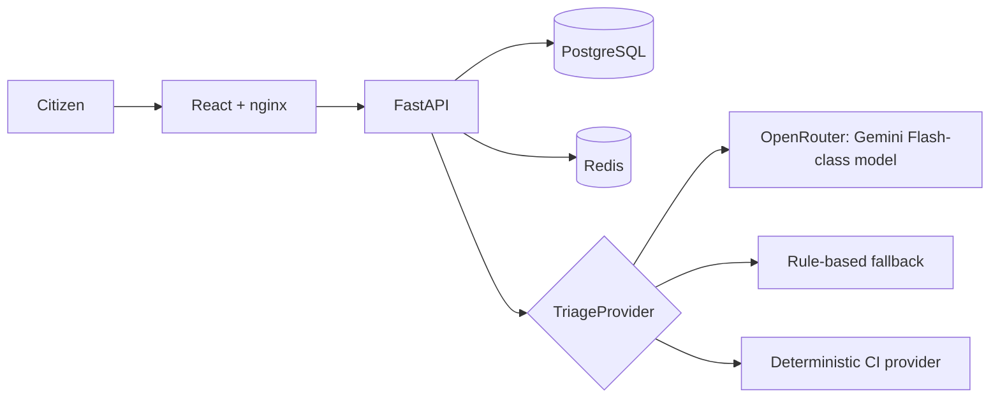

# CivicPulse

Municipal complaint intake, AI-assisted triage, and operations dashboard for **CS4032 — Software Construction and Design, Assignment 1**.

> Status: Day 1 foundation in progress. The backend domain and triage layers are implemented and verified; PostgreSQL/Redis, frontend, containers, Kubernetes, and CI are next.

## Architecture



## Development status

| Capability | Status |
| --- | --- |
| Domain/status transition table | Implemented and tested |
| Deterministic simulated triage | Implemented and tested |
| Rule-based fallback | Implemented and tested |
| OpenRouter adapter with validated JSON | Implemented; requires environment credentials |
| Database, Redis, API routes | Foundation created; integration is in progress |
| Frontend, Compose, Kubernetes, CI/CD | Planned |

## Local backend checks

```powershell
cd backend
.\.venv\Scripts\python.exe -m pytest tests -q
.\.venv\Scripts\python.exe -m ruff check .
.\.venv\Scripts\python.exe -m mypy app
```

## Docker Compose

Start the complete frontend, API, PostgreSQL, Redis, migration, and seed stack:

```powershell
Copy-Item .env.example .env
docker compose up --build
```

Then open `http://localhost:8080`. The browser accesses the API through nginx
at `/api`; PostgreSQL and Redis intentionally have no host ports. See
[container guidance](docs/CONTAINERS.md) for the development and production
Compose profiles, data persistence, and verification commands.

## API contract workflow

The checked-in [OpenAPI schema](backend/openapi.json) is the contract between
the FastAPI backend and the React client. After changing API request or
response models, regenerate it and the frontend types:

```powershell
cd backend
.\.venv\Scripts\python.exe -m scripts.export_openapi
cd ..\frontend
npm run generate:api
npm run check:api
```

`npm run check:api` uses the tracked schema by default, so it works from a
clean checkout without a running backend. CI may override it with
`OPENAPI_SCHEMA_PATH` after exporting a fresh schema.

## Security

- Copy `.env.example` to `.env` for local configuration. Never commit `.env`.
- Keep `OPENROUTER_API_KEY` server-side only; a browser bundle must never contain it.
- CI will use `TRIAGE_PROVIDER=simulated`; a live hosted provider is not needed for automated tests.

## Project documents

- [Project plan](docs/PROJECT-PLAN.md)
- [Project charter](docs/PROJECT-CHARTER.md)
- [AI-use disclosure](docs/AI-USAGE.md)
